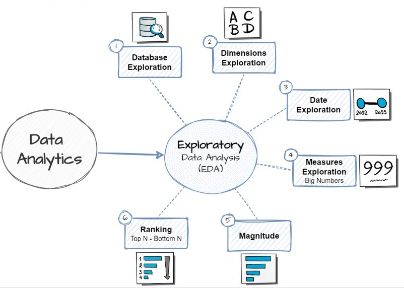
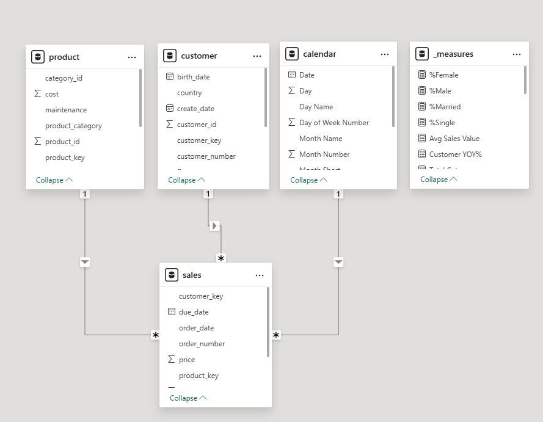
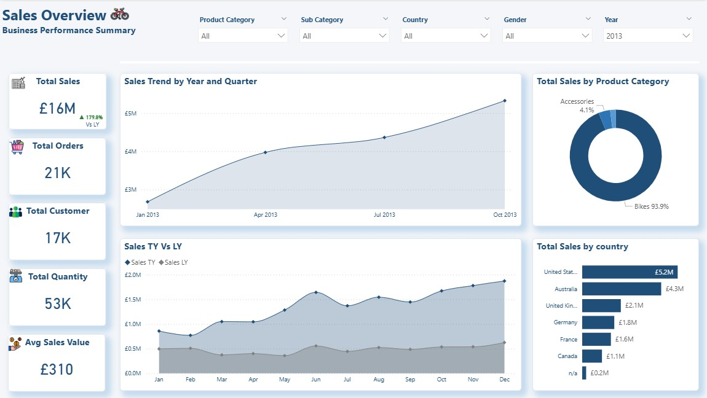
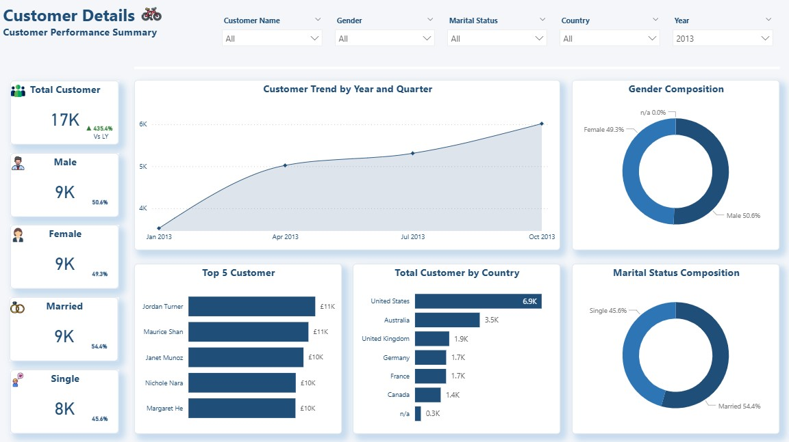
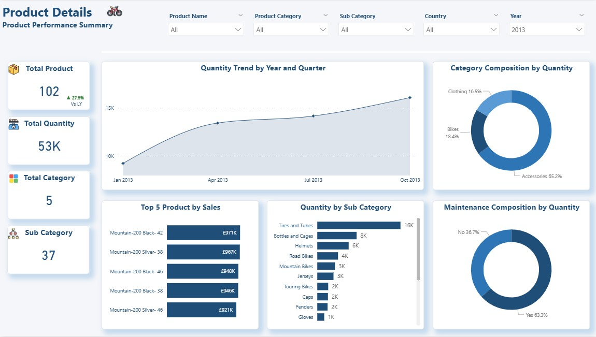

# 🚴 Aurora Cycles End to End Sales Analytics Project

## 📌 Business Context

Aurora Cycles is a global bicycle manufacturer and retailer operating across North America, Europe, and Australia. The company sells bikes, accessories, and related components to a diverse customer base through multiple channels.

As the business expanded internationally, leadership required greater visibility into:

- Overall revenue performance  
- Product and category contribution  
- Customer segmentation and demographics  
- Geographic sales distribution  
- Year-over-year growth trends  

Although detailed transactional data existed (Adventure Works dataset), it lacked a structured analytical layer and executive-ready reporting framework.

This project simulates how Aurora Cycles transforms operational data into structured business intelligence.

---

## 🎯 Problem Statement

Aurora Cycles does not have a centralized reporting system that enables stakeholders to:

- Monitor revenue performance consistently  
- Identify top-performing products and categories  
- Recognize high-value customers  
- Analyze sales by country and region  
- Track growth trends over time  

The data exists, but actionable insights are not easily accessible.

---

## 🎯 Project Goal

To design and implement an end-to-end analytics solution that:

- Structures transactional data into a star-schema warehouse  
- Performs SQL-based exploratory data analysis (EDA)  
- Defines key business KPIs  
- Develops interactive Power BI dashboards  
- Enables data-driven strategic decision-making  

---

## 🏗 Solution Architecture

The solution follows a layered analytical approach:

- Structured SQL Data Warehouse (Star Schema)  
- SQL-based data warehouse exploration  
- Exploratory Data Analysis (SQL)  
- KPI Definition & Validation  
- Power BI Executive Dashboard   

This architecture ensures scalability, performance, and analytical flexibility.

---

# 🏗 Architecture Overview

## Medallion Architecture


The warehouse follows a medallion-style layered architecture:

- **Bronze Layer** – Raw operational data  
- **Silver Layer** – Cleaned and transformed data  
- **Gold Layer** – Analytical star schema for reporting  

This layered approach ensures:

- Data quality control  
- Structured transformation  
- Optimized performance for BI consumption  


---

# 🔎 SQL Exploratory Data Analysis (EDA)



Before dashboard development, SQL was used to explore and validate the warehouse data.

### Exploration Included:

- Database schema inspection  
- Dimension validation  
- Date range analysis  
- KPI aggregation (Sales, Orders, Quantity, Customers)  
- Revenue distribution by category and country  
- Customer segmentation analysis  
- Product and customer ranking  

This ensured KPI accuracy before visualization and helped define key business metrics.

---

# ✅ Data Quality Checks


Data validation steps were performed to ensure reliability:

- Null value detection  
- Duplicate record validation  
- Date boundary verification  
- Key relationship validation  
- Aggregation cross-checks  

These checks ensured:

- Referential integrity  
- Consistent dimensional joins  
- Accurate KPI calculations  


---

# 🧠 Data Model



The analytical layer follows a **star schema design**.

### ⭐ Fact Table
`fact_sales`
- order_date  
- order_number  
- sales_amount  
- quantity  
- product_key  
- customer_key  

### 📘 Dimension Tables
`dim_customers`
- gender  
- country  
- marital_status  
- birthdate  

`dim_products`
- product_name  
- category  
- subcategory  
- cost  

`calendar`
- date  
- year  
- quarter  
- month  

This structure enables:

- Efficient aggregations  
- Flexible slicing across dimensions  
- Time intelligence calculations  
- Strong compatibility with Power BI  

---

# 📊 Power BI Dashboard

The Power BI report consists of three analytical pages.

---

## 1️⃣ Sales Overview



Executive performance summary including:

- Total Sales  
- Total Orders  
- Total Customers  
- Total Quantity  
- Average Sales Value  
- Year-over-Year Growth  
- Sales Trend by Quarter  
- Sales by Category  
- Sales by Country  
- Sales TY vs LY comparison  

---

## 2️⃣ Customer Details



Customer performance and segmentation analysis:

- Customer growth trend  
- Gender composition  
- Marital status distribution  
- Top 5 customers by revenue  
- Customer distribution by country  

---

## 3️⃣ Product Details



Product performance analysis:

- Quantity trend over time  
- Category contribution  
- Subcategory breakdown  
- Top 5 products by sales  
- Maintenance distribution  

---

# 📈 Key DAX Measures

```DAX
Total Sales = SUM(fact_sales[sales_amount])

Sales LY =
CALCULATE(
    [Total Sales],
    SAMEPERIODLASTYEAR(calendar[Date])
)

YoY % =
DIVIDE(
    [Total Sales] - [Sales LY],
    [Sales LY]
)
```

Additional features implemented:

- Dynamic KPI indicators (▲ / ▼)
- Conditional formatting
- Ranking measures
- Time intelligence calculations

---

# 🎯 Business Questions Addressed

- How is Aurora Cycles performing year over year?
- Which product categories generate the most revenue?
- What markets contribute most to sales?
- Who are the highest-value customers?
- How do customer demographics influence performance?
- What trends exist in product demand?

---


# 🚀 Future Development

Potential enhancements include:

- Rolling 12-Month (R12) performance analysis  
- Customer Lifetime Value (CLV) modeling  
- Profit margin analysis  
- Row-Level Security (RLS) implementation  
- Automated ETL pipeline integration  
- Deployment to Power BI Service

---  

# 🛠 Tools & Technologies

- SQL Server  
- T-SQL  
- Star Schema Modeling  
- Power BI Desktop  
- DAX  
- Time Intelligence Functions  

---

# 🔄 End-to-End Flow

Raw Operational Data  
→ Medallion Data Architecture  
→ Gold Layer Star Schema  
→ SQL-Based KPI Exploration  
→ Power BI Modeling  
→ Executive Dashboard Insights

---

# 📂 Repository Structure

```
dataset/
 └── datasets/
     ├── gold.dim_customers.csv
     ├── gold.dim_products.csv
     └── gold.fact_sales.csv

docs/
 ├── EDA.jpg
 ├── Executive_Blue_Theme.json
 ├── Medallion Architecture.jpg
 ├── customer_details.jpg
 ├── data_quality_check.jpg
 ├── data_model.jpg
 ├── product_details.jpg
 └── sales_overview.jpg

pbix/
 └── Aurora Cycle Sales Dashboard.pbix

scripts/
 ├── 01_database_exploration.sql
 ├── 02_dimensions_exploration.sql
 ├── 03_date_range_exploration.sql
 ├── 04_measures_exploration.sql
 ├── 05_magnitude_analysis.sql
 └── 06_ranking_analysis.sql
```


---

# 📌 Conclusion

This project demonstrates how structured warehouse data can be transformed into decision-ready insights using SQL and Power BI.

It showcases:

- Dimensional modeling best practices  
- SQL-driven KPI validation  
- Data quality assurance  
- Executive dashboard storytelling  
- Time intelligence implementation  

---

# 🙏 Gratitude

This project is inspired by the work of:

- **Baara Salkini**  
- **Ripan Rudra**

---

# 📫 Contact

Connect with me on LinkedIn:

🔗 www.linkedin.com/in/skundu97  

## 📄 License

This project is licensed under the terms specified in the LICENSE file.

